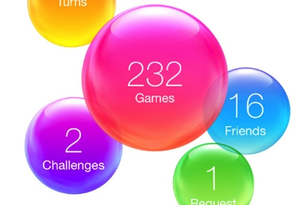

# Tammy's Tantrums

A minimal social media site wherein users can express there thoughts (tantrums) using short messages. Each user gets their own profile page and users can discover others via the Discover page.

Built using Next.js, persistent data retention by MongoDB Atlas and hosted on Vercel.

## Setup

-   Clone this repository
    ```
    git clone https://github.com/sibi361/tammys-tantrums.git
    ```
-   Install [NodeJS](https://nodejs.org/en/download)
-   Install dependencies
    ```
    cd tammys-tantrums
    npm install
    ```

### Local Testing

-   Run the server
    ```
    npm run dev
    ```
-   Visit the site at the displayed URL

-   Deploy to Vercel using:
    ```
    vercel --prod
    ```
- Make sure to have set the environment variables given in [`.env.example`](.env.example) set on Vercel

## Inspiration

This project's frontend was inspired by the iOS game center app:


